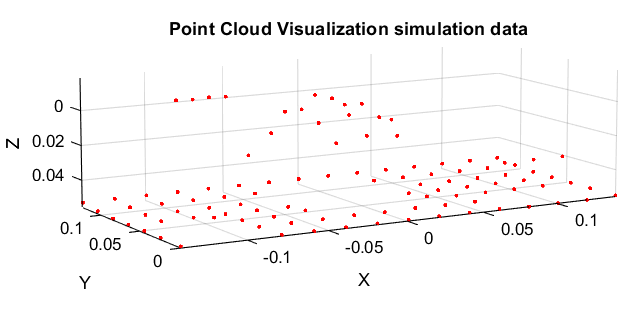

# Automated Landmine probing simulation using MuJoCo
This project introduces a simulated anti-tank mine prober utilizing robotics and machine learning to automate detection processes. By leveraging the MuJoCo simulation platform, we aim to reduce risks for volunteers and contribute to global demining efforts. The simulation generates point cloud data, potentially aiding future machine learning initiatives to differentiate between landmines and other objects.

Currently synthetic data generation and Neural network training is being done. For this purpose, a Python code is added to generate different worlds with randomized position of landmines and objects representing rocks.

## How to run
- Install the MuJoCo simulation software
- Clone this repo
-Run the Probing.py python file

## Software
- MuJoCo - Python, XML
- Autodesk Fusion 360 - STL
- MATLAB

## Simulation Model Video

Click on the thumbnail to see the video!

## MuJoCo simulation overview
- **Two-File System:**  MuJoCo operates using a two-file system: an XML file describes the model's structure, while a Python script executes and manipulates this model.

- **Interactive Visualization:** The simulation includes interactive visualization with a native GUI, rendered in OpenGL, offering a user-friendly interface for model manipulation.

- **Physics Computation Functions:** MuJoCo provides a wide range of utility functions for computing physics-related quantities, ensuring accurate simulation of physical interactions.

- **Importing 3D Models:** Custom models can be seamlessly integrated into the simulation environment using STL (binary) or Obj file formats. The 3D models are created in Autodesk Fusion 360, with each part exported in STL binary format, specified in meters.

- **Joint Definition:** The simulation enables the definition of various joints, such as prismatic joints, to simulate specific movements and actions of robotic systems.

- **Parameter Adjustments:** Parameters like inertia, friction, and mass can be adjusted to fine-tune the simulation to specific requirements.

- **Environmental Considerations:** While aiming to replicate real-world conditions, the simulation may require simplifications and lacks environmental factors like sand or mud. These can be incorporated into hardware prototypes during development phases.

## Experimental Setup and Methodology

- **Data Generation**: The experiment focused on generating a dataset of the entire testing area. Probing actions were executed at a fixed 30° angle, recording depth information until a predefined force threshold was reached.

- **Detection Mechanism**: Probing actions aimed to detect reactionary forces using an end-mounted sensor upon encountering an obstacle, such as a mine. Once the specified force threshold was exceeded, probing ceased, and corresponding depth data was recorded.

- **Mapping and Data Processing**: Depth data collected from probing actions were utilized to map all points across the testing area, resulting in a point cloud representation using MATLAB. The accumulation of sufficient data points aimed to facilitate the training of a neural network for distinguishing anti-tank mines from ordinary obstacles.

- **Choice of Simulation Platform**: MuJoCo was selected for its reputation and endorsement by Google's DeepMind, offering extensive documentation and a range of sensors and actuators.
MuJoCo Documentation: https://mujoco.readthedocs.io/en/stable/programming/index.html

- **Sensor Utilization**: Primary sensors utilized in the simulation included Force and Position sensors. Rotary encoders were replaced with position sensors for enhanced accuracy, and a force sensor was integrated at the probe's end to effectively record force values.

- **Data Augmentation**: To simulate real-world scenarios, artificial data generation techniques were employed to supplement the dataset, providing insight into the expected appearance of real-world data.

## Real-World Model Circuit Diagram
This is how the circuit diagram designed for the physical model:

